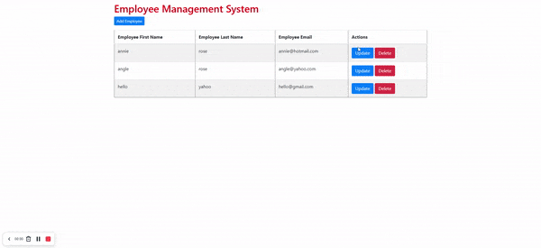
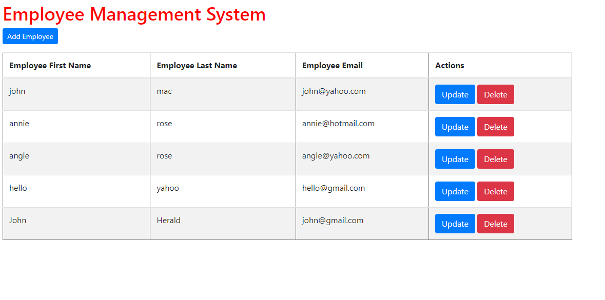
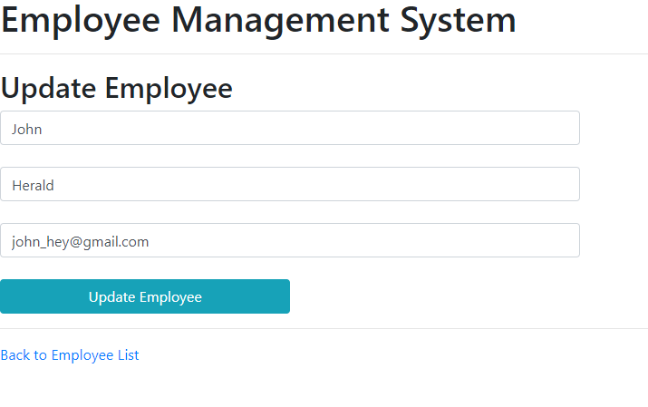

## EMPLOYEE MANAGEMENT SYSTEM

A Spring booot Java project created using Spring Boot, Spring Security, Thymeleaf, implementing a RESTful CRUD API and integrating with MySql Workbench.

---

## Table of contents

- [Introduction](#introduction)
- [Competencies](#competencies)
- [Demo](#demo)
- [Technologies](#technologies)
- [Setup](#setup)
- [Features](#features)
- [Contact](#contact)

---

## Introduction
 A Spring boot CRUD web application with dependencies- Spring Web Spring MVC ,Thymeleaf ,Spring Data JPA ,Hibernate and MySQL Driver
Employee Management System is a CRUD application where you can view all the employees.You can add, update and delete employees.

---

## Competencies 

#JF 2.2
- Understands how to create and analyze artefacts, such as use cases and/or user stories

#JF 3.4
- Able to create simple software designs to effectively communicate understanding of the programUnderstands how to develop effective user interfaces

#JF 6.4
- Works independently and takes responsibility. For example, has a disciplined and responsible approach to risk, and stays motivated and committed when facing challenges

---

## Demo

<h1 align="center">
  Employee Management System.
</h1>

 An app made with the help of Spring boot Java.
    

---

## Screenshots

* Home Page:

* Add Employee form Page:

* Update Page:

---

## Technologies

- JDK Java 1.8 - version 8
- Spring boot - version 2.5.5
- Mysql workbench - version 6.0
- IntelliJ IDEA - version 2.4
- Postman
- Spring Initializr https://start.spring.io/

---

## Setup

To run this project, install it locally 
 - `Run as Spring-boot`
 
 ### Installation:

1. Development Platform - Eclipse / IntelliJ Idea
   * [Download Eclipse](https://www.eclipse.org/downloads/packages/eclipse-ide-java-ee-developers/mars2).
   * [Download IntelliJ Idea](https://www.jetbrains.com/idea/download/#section=windows).
2. Server - Apache Tomcat Server

   * [Download Apache Server](https://tomcat.apache.org/download-70.cgi).

3. Build Tool - Maven

   * [Download Maven](https://maven.apache.org/download.cgi).

4. Database - MySQL workbench

5. Configuring tomcat with Eclipse (windows) - [Click Here](https://javatutorial.net/run-tomcat-from-eclipse).

6. Installation of maven in eclipse - [Click Here](https://stackoverflow.com/questions/8620127/maven-in-eclipse-step-by-step-installation).

7. Clone the repository and import it to eclipse.

---

## Features

Users should be able to:
- view the employees list.
- add employee information by completing the form.
- update and delete employees.

Stretch Goals:

- Deploy the app on Heroku.
- Registration and Login Functionality.
- Implement OAuth or basic Auth.

---

## Contact
- [Afreen S Mohammed](https://github.com/afreensafdar)

